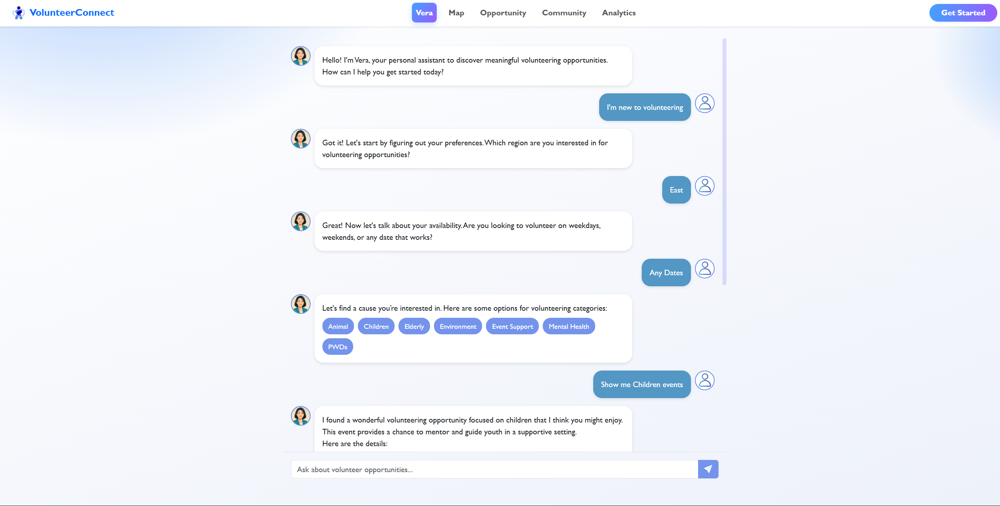
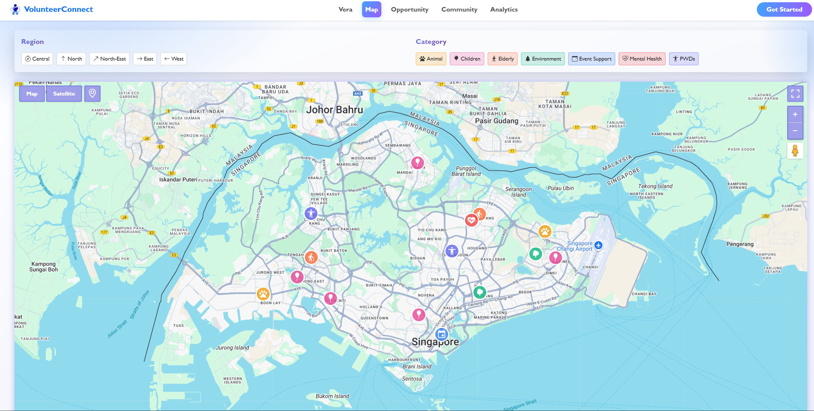
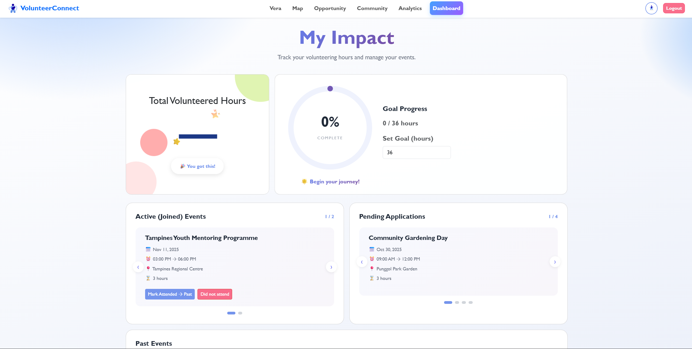
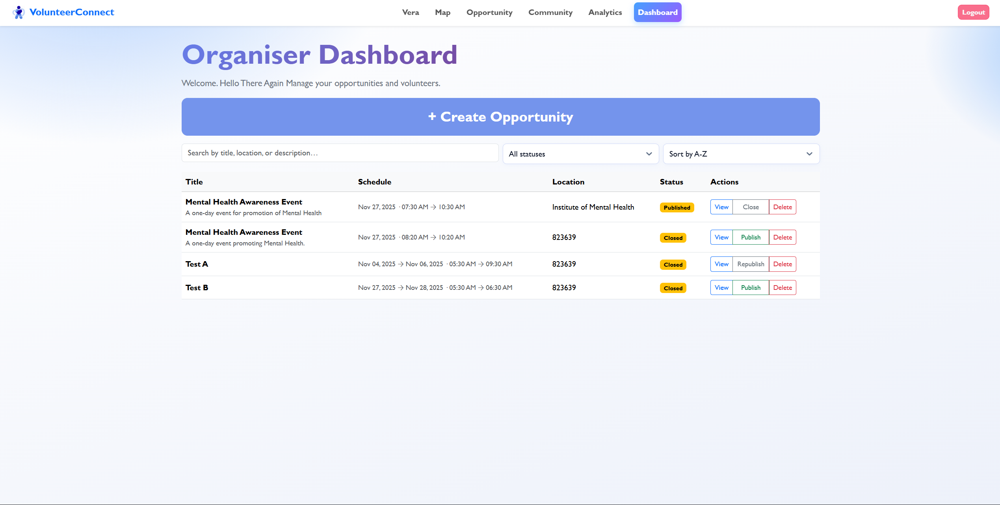
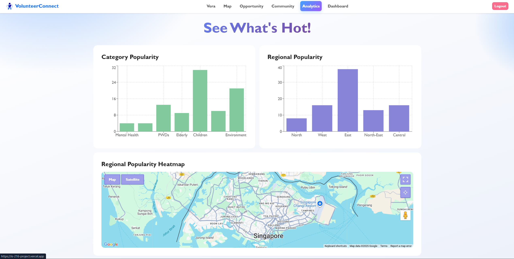

# 🌍 IS216 Web Application Development II
**Project Title:** VolunteerConnect  

---

## Section & Group Number
**Example:** G3 Group 6

---

## Group Members

| Photo | Full Name | Role / Features Responsible For |
|:--:|:--|:--|
|  | Anson Poh Jing En | Backend Developer, Database & Auth - AI Chat, Supabase Integration |
|  | Sitinur | Frontend Developer - Opportunity Listing |
|  | Liang Keying | Backend Developer, UI/UX - Landing Page, AI Chat, Webpage Layout |
|  | Riya Philip | Frontend Developer, UI/UX - Opportunity Listing, Community Page |
|  | Cher Zhi Rui Joshua | Frontend Developer - Interactive Map, Community Page |
|  | Siew Yuanlong | Frontend Developer - Login/Signup, Profile, Dashboards |

---

## Business Problem

Current volunteer recruitment systems, like WhatsApp polls and manual coordination, are inefficient. They lead to long waiting times (weeks to months), poor visualization of opportunities, and a frustrating experience that discourages potential volunteers. This creates a significant barrier between passionate individuals and NGOs in need of support.

**Volunteer Connect** aims to simplify and accelerate the volunteer–NGO matching process by providing a centralized, easy-to-use platform. It addresses the inefficiencies of current systems (long waiting times, scattered opportunities, and poor visibility) by offering features like AI-powered opportunity recommendations, interactive maps, and real-time event management. Volunteers can quickly discover, track, and engage with opportunities that match their interests, while NGOs can efficiently manage sign-ups and communicate with participants.

---

## Web Solution Overview

### 🎯 Intended Users
- Students and young adults looking for volunteer opportunities island-wide  
- Non-profit organisations (NGOs) managing events and volunteers  

### 🚀 What Users Can Do & Benefits

| Feature | Description | User Benefit |
|:--|:--|:--|
| **Register & Login** | Secure authentication system | Personalized experience and data security |
| **AI Chat** | AI Chat that interacts with users to recommend suitable volunteering opportunities | Saves time and effort by quickly guiding users to relevant opportunities |
| **Interactive Map** | Dynamic map displaying volunteering opportunities with regional and category filters, and custom markers | Easy and visually-appealing location-based opportunity lookup |
| **Opportunities Listing** | List of all opportunities available | Provides detailed information and simplifies the process of signing up for events |
| **Communities Page** | Social page where organisations and users can share images with captions of volunteering experiences | Encourages community engagement and sharing of memorable moments, motivating more volunteering |
| **Analytics Page** | Visual analytics of popular volunteering categories, regions, and a heatmap for insights | Allows users to see popular volunteering categories, regions and heatmap to help them make informed decisions on what to volunteer for |
| **Organiser Dashboard** | Tool for organisers to create events and manage volunteer sign-ups in one place | Allows organisers to create events and manage volunteer sign ups all in one place |
| **Volunteer Dashboard** | Dashboard for volunteers to set goals, track past and ongoing events, and manage pending applications in one place | Helps volunteers stay organized and monitor their volunteering progress efficiently

---

## 🧰 Tech Stack

| Logo | Technology | Purpose / Usage |
|:--:|:--|:--|
|  | **HTML5** | Page structure and markup |
|  | **CSS / Bootstrap** | Styling and responsive layouts |
|  | **JavaScript** | Client-side logic and API calls |
|  | **React.js** | Frontend framework for component-based architecture |
|  | **Node.js + Express** | REST API backend server |
|  | **Supabase (PostgreSQL)** | Authentication and data storage |
|  | **Recharts / GSAP / Framer Motion** | Analytics visualization & smooth animations |
|  | **Vercel** | Frontend hosting |
|  | **Render** | Backend hosting |

---

## 🧭 Use Case & User Journey

Provide screenshots and captions showing how users interact with your app.

1. **Landing Page**  
     
   - Welcomes users with introduction and sign-in options.

2. **AI Chat (Vera)**  
     
   - Users interact with “Vera” to receive personalized volunteering suggestions.

3. **Interactive Map**  
     
   - Users explore opportunities by region and category visually.

4. **Volunteer Dashboard**  
     
   - Tracks ongoing, approved, and past volunteering events.

5. **Organiser Dashboard**  
     
   - Enables creation and management of events with registration tracking.

6. **Analytics Page**  
     
   - Displays most popular categories and regions in bar charts and heatmaps.

> Screenshots stored in `/screenshots`.

---

## 🧑‍💻 Developers Setup Guide

Comprehensive steps to help other developers or evaluators run and test your project.

---

### 0) Prerequisites
- [Node.js](https://nodejs.org/) v18+  
- [Git](https://git-scm.com/) v2.4+  
- Access to [Supabase](https://supabase.com/) project  
- (Optional) [Render](https://render.com/) & [Vercel](https://vercel.com/) accounts for deployment  

---

### 1) Clone the Repository
```bash
git clone https://github.com/ansonpoh/IS216_Project.git
cd IS216_Project
npm install
```

---

### 2) Install Dependencies

**Backend**
```bash
cd backend
npm install
```

**Frontend**
```bash
cd frontend 
npm install
```

---

### 3) Configure Environment Variables
Create a `.env` file in the backend folder with the following structure:

```bash
DATABASE_URL=<your_backend_url>
SUPABASE_URL=<your_supabase_url>
SUPABASE_KEY=<your_supabase_api_key>
GOOGLE_MAPS_API_KEY=<your_google_maps_api_key>
OPENAI_API_KEY=<your_openai_api_key>
```

Create a `.env` file in the frontend folder with the following structure:
```bash
REACT_APP_SUPABASE_URL=<supabase_url>
REACT_APP_SUPABASE_ANON_KEY=<supabase_anon_key>
REACT_APP_API_URL=http://localhost:3001
```

> Never commit the `.env` file to your repository.  
> Instead, include a `.env.example` file with placeholder values.

---

### 4) Run the Application Locally

**Start Backend**
```bash
cd backend
npm run dev
```

**Start Frontend**
```bash
cd frontend
npm start
```

---

### 5) Testing the Application

#### Manual Testing
Perform the following checks before submission:

| Test Area | Description | Expected Result |
|:--|:--|:--|
| Authentication | Sign up, login, logout via Supabase | User can authenticate successfully |
| AI Chat | Ask for volunteering suggestions | Returns suitable events |
| Map Page | Use region/category filters | Markers update accordingly |
| Dashboards | Organizer CRUD; Volunteer history | Data creates/updates correctly |
| Community Page | Post, like/unlike feedback | UI updates reflect DB state |
| Analytics | View bar charts & heatmap | Matches real registration data |

---

### 6) Common Issues & Fixes

| Issue | Likely Cause | Fix |
|:--|:--|:--|
| CORS errors | Frontend domain not allowed | Add domain(s) to `CORS_ORIGIN` in backend `.env` |
| OAuth redirects to localhost | Supabase `Site URL` not updated | Set `https://is-216-project.vercel.app` in Supabase Auth |
| `Axios 404` | Wrong API base URL | Ensure `REACT_APP_API_URL` points to backend |
| DB permission errors | RLS/policies blocking access | Add appropriate policies for anon/service-role |
| Wrong counts/capacity | Missing `LEFT JOIN`/`GROUP BY` | Use `COUNT()` with joins and `GROUP BY event_id` |

---

### 7) Deployment

**Backend(Render)**
   1. Create a **Web Service** from Git repo -> /backend 
   2. Build command: `npm install`
   3. Start command: `npm start`
   4. Add `.env` variables
   5. Copy deployed URL and replace REACT_APP_API_URL in frontend .env

**Frontend**(Vercel)
   1. Import repo -> Select `/frontend` folder
   2. Add `.env` variables
   3. Build Command: `npm run build`
   4. Deployed URL: https://is-216-project.vercel.app

## Group Reflection

Each member should contribute 2–3 sentences on their learning and project experience.

> - *Anson:* Learned more in detail about cloud databases and configuring an agentic AI. Gained more experience in overall web development.
> - *Sitinur:* Gained experience building and styling responsive frontend interfaces with dynamic data.
> - *Keying:*  Gained experience connecting frontend and backend API endpoints. Created reusable components.  
> - *Riya:* Learned how to use reusable React components, design the frontend UI and understood how data is retrieved from the backend using routes and controllers.
> - *Joshua:* Learned how to manage API-implemented elements, as well as map filter logic. Also learned how different methods of styling are used for different cases, i.e. styling API in-built elements, default components.
> - *Yuanlong:* Learned how to route pages and connect different components effectively and how to manage dynamic content across pages.

As a team, reflect on:
- Key takeaways from working with real-world frameworks  
- Challenges faced and how they were resolved  
- Insights on teamwork, project management, and problem-solving  

> - Key Takeaways:
Working with real-world frameworks like React and Node.js taught us the importance of proper architecture and code organisation. Integrating Supabase for authentication and database management gave us hands-on experience with modern cloud-based solutions. We learned that building scalable applications requires careful planning of API endpoints, proper state management, and understanding how frontend and backend communicate effectively. The use of APIs from Google Maps and OpenAI showed us how to make use of existing services to enhance functionality rather than building everything from scratch.

> - Challenges and Solutions:
One major challenge was configuring CORS and OAuth redirects when deploying to production environments. Initially, authentication worked locally but failed on Vercel, which we resolved by properly configuring the Supabase Site URL and backend CORS origins. Another issue was managing database queries efficiently. Ensuring accurate volunteer counts and event capacities required careful use of JOINs and GROUP BY clauses. We also faced difficulties coordinating across multiple features simultaneously, which we addressed by maintaining consistent communication through regular check-ins.

> - Teamwork and Project Management:
Clear role allocation (frontend, backend, UI/UX) helped us work simultaneously without blocking each other, though it required constant communication to ensure components integrated smoothly. Using Git for version control was crucial but also led to merge conflicts that taught us the value of frequent commits and clear branch naming. Regular testing of each feature across different team members' machines helped us to catch any environment-specific issues. Overall, this project reinforced that successful web development is as much about collaboration and communication as it is about coding skills.